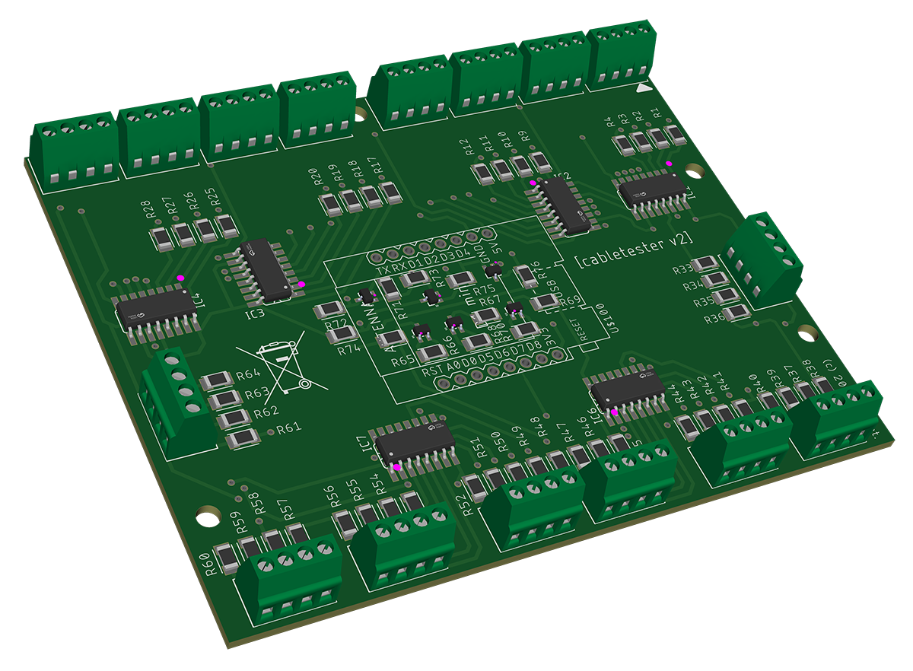
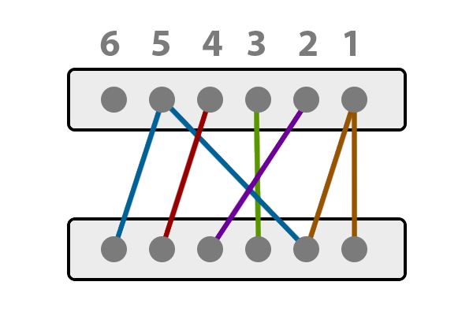
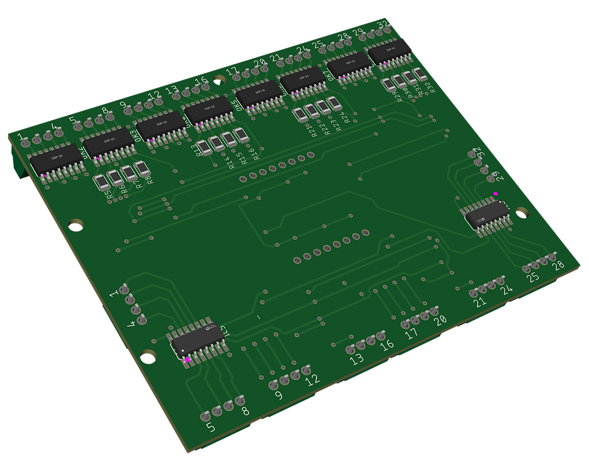
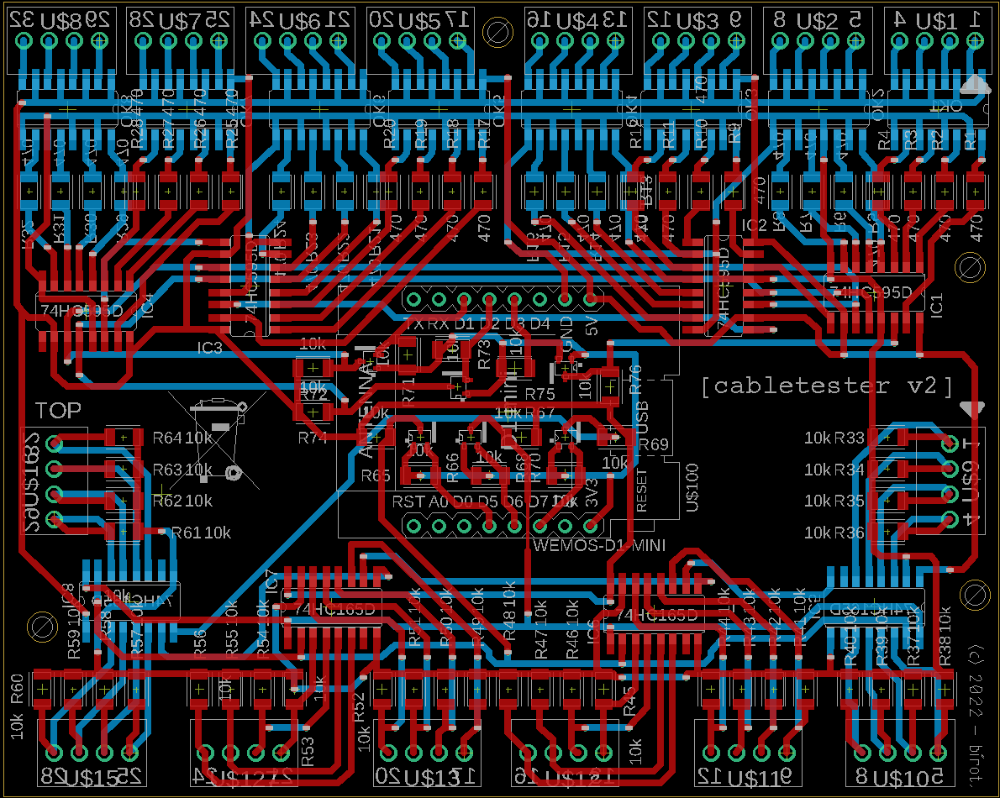
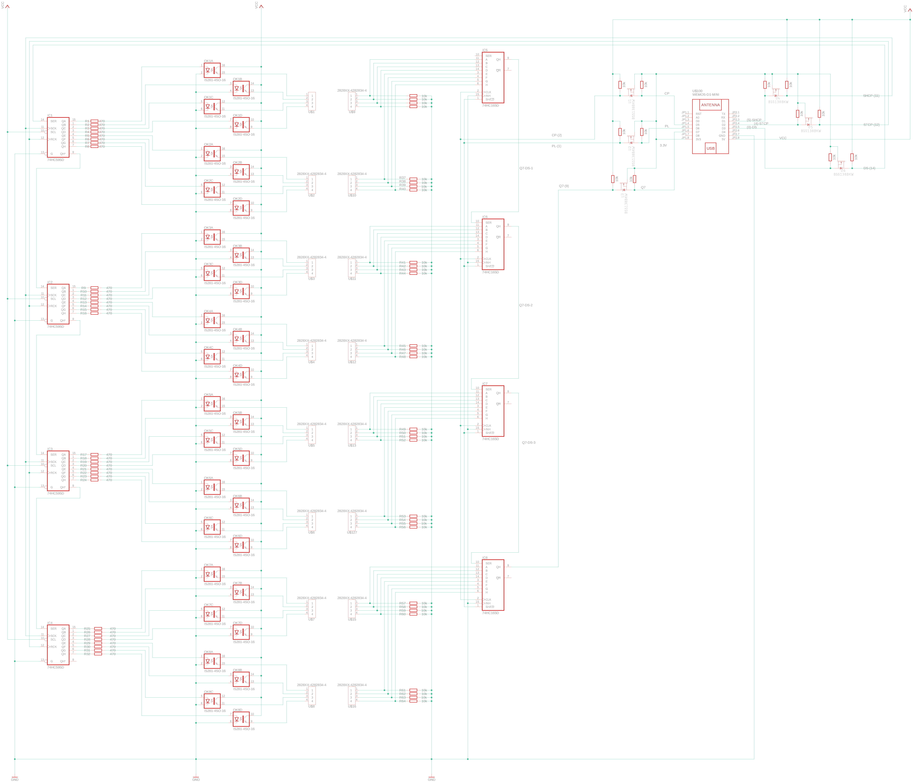

## Overview
The Universal Cable Tester Board is a tool designed to test the continuity and proper wiring layout of any cables up to 32 wires. This project includes the design schematics, PCB layout, firmware, and software for the cable tester.

This board is not a standalone device, it must be connected to a computer (running Windows) through USB cable and the [Cable Analyzer](https://github.com/david-biro/UniversalCableAnalyzer) (opensource) must run on that machine. For more details about the software, click [here](https://github.com/david-biro/UniversalCableAnalyzer).

<p align="center">
  
</p>

## How it works
### The hardware
The core of the Cable Tester board is a Wemos D1 Mini (ESP8266) microcontroller, which initiates the measurements, collects the test results, and sends the data back to the Cable Analyzer software running on the PC. The Cable Analyzer then evaluates the test results and visualizes them on the GUI. Communication is conducted via a USB connection, utilizing the UART port of the ESP8266, which is connected to a CH340 (or occasionally a CP2104) USB-to-Serial chip. This chip provides USB client connectivity to the ESP8266; therefore, it is required to install a serial port driver on the computer, for example from [here](http://www.wch-ic.com/downloads/CH341SER_ZIP.html).

The measuring mechanism is very simple: when the Cable Tester board receives the `<START>` string via serial, the microcontroller loops through the pins from 1 to 32 and applies 5V to them one by one. In every cycle, it measures and collects the response from the other side accordingly. When it reaches the last pin, it sends the result back to the Cable Tester application to evaluate and visualize.

Example cable layout and its serial output:
<p align="center">
  
</p>

  ```
  <RESULT,3,8,4,16,34,0,0,0,0,0,0,0,0,0,0,0,0,0,0,0,0,0,0,0,0,0,0,0,0,0,0,0>
  ```
_Explanation:_ The output string is a comma-separated list of 32-bit integers containing the results for the pins from 1 to 32, listed from left to right respectively. By taking the binary representation of each value, the cable layout can be verified. See:

```
pin:                       [32]                             [1]  
                                       (binary)                  (decimal)
request sent on "A" side:  00000000 00000000 00000000 00000001       1
response got on "B" side:  00000000 00000000 00000000 00000011       3

request sent on "A" side:  00000000 00000000 00000000 00000010       2
response got on "B" side:  00000000 00000000 00000000 00001000       8

request sent on "A" side:  00000000 00000000 00000000 00000100       4
response got on "B" side:  00000000 00000000 00000000 00000100       4

request sent on "A" side:  00000000 00000000 00000000 00001000       8
response got on "B" side:  00000000 00000000 00000000 00010000       16

request sent on "A" side:  00000000 00000000 00000000 00010000       16
response got on "B" side:  00000000 00000000 00000000 00100010       34

request sent on "A" side:  00000000 00000000 00000000 00100000       32
response got on "B" side:  00000000 00000000 00000000 00000000       0

...

request sent on "A" side:  10000000 00000000 00000000 00000000   2147483648
response got on "B" side:  00000000 00000000 00000000 00000000       0
```

To understand this circuit, [here](https://wokwi.com/projects/403145055048695809) is an Arduino playground on **Wokwi** which simulates a straight cable (where pin 1 is connected to pin 1, pin 2 to pin 2, etc.). For better visualization, the wire "connections" are interrupted by LEDs, so when they flash, it means the checking is actually taking place.

Due to the lack of pins on ESP8622, shift registers are used on both side. On the `write` (or "A" side) 4 pcs of [74HC595](https://www.diodes.com/assets/Datasheets/74HC595.pdf) 8-bit serial-in/parallel-out shift registers are used in daisy chain to get 32-bit parallel output from the 32-bit serial input on the DS pin. On the `read` (or "B" side) 4 pcs of [74HC165](https://www.sparkfun.com/datasheets/Components/General/sn74hc165.pdf) parallel-in/serial-out shift registers are used. Between the `write` side and the green terminal blocks, 8 pcs of [IS281-4](https://docs.rs-online.com/c7c9/0900766b81617f80.pdf) NPN type optocouplers are used to isolate wires. 

<p align="center">
  
</p>

### The firmware
The firmware is written in C++ using [PlatformIO](https://platformio.org/)

### Cable connector headers
Currently, only a 24 pin Molex PCB connector is included in this repo, future plans are to add more. Until that, every contributions are welcomed.

## Eagle files
The PCB is double-sided, contains only SMD components (except the 16 pcs through-hole terminal blocks). Here is the list of components:

| Qty | Component | Package |
|---|---|---|
| 4 | 74HC165D | SOIC-16 |
| 4 | 74HC595D | SOIC-16 |
| 8 | IS281 | SOIC-16 |
| 6 | BSS138BKW | SOT-323 |
| 16 | TH Terminal block | XY308-2.54-4P |
| 44 | 10 kΩ | R1206 |
| 32 | 407 Ω| R1206 |

For more details and LCSC partnumbers, please refer the partlist BOM file.

<p align="center">
  
  
</p>

## Manufacturing
The final board was created by JLCPCB. For that the Gerber files, the LCSC partlist (BOM) and the Centroid (CPL) files are also included in this repo.

## Contributing
Every contributions are welcomed to improve the Universal Cable Tester. You can fork the repository and submit pull requests for any enhancements or bug fixes.

## License
This project is licensed under the GNU GPLv3 License - see the LICENSE file for details.